# Spoonacular API Setup Tutorial

## Executive Summary
"Recipes" is a minimalist front-end implementation of the Spoonacular API. The app provides two functions: finding a recipe and planning a week's worth of meals. Finding a recipe implements endpoints related to queries and retrieving data objects. Meal planning implements a widget that accepts any or no inputs for daily calories, special diets, and food exclusions. The goal of the web application is to provide a non-overwhelming interface that enables users to cook more at home. Terminally, users may save money and maintain a healthier diet.

In implementing the application, a variety of endpoints will be used. They may be divided into the categories of "search", "view", and "plan". 

## Search
We will be retrieving data on a recipe for SPAM® Musubi. The endpoint for receiving a list of results for a query is **GET https://api.spoonacular.com/recipes/search**. It accepts string parameters titled, "query", "cuisine", "diet", "excludeIngredients", and more. 

Querying is a fairly straightforward operation requiring only the natural language query and an API key.

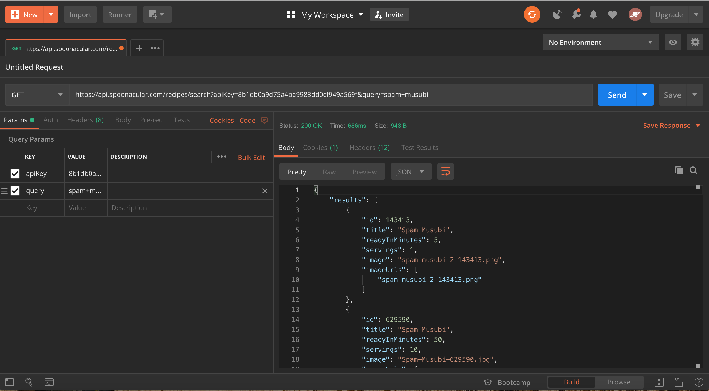
*A simple query in Postman*

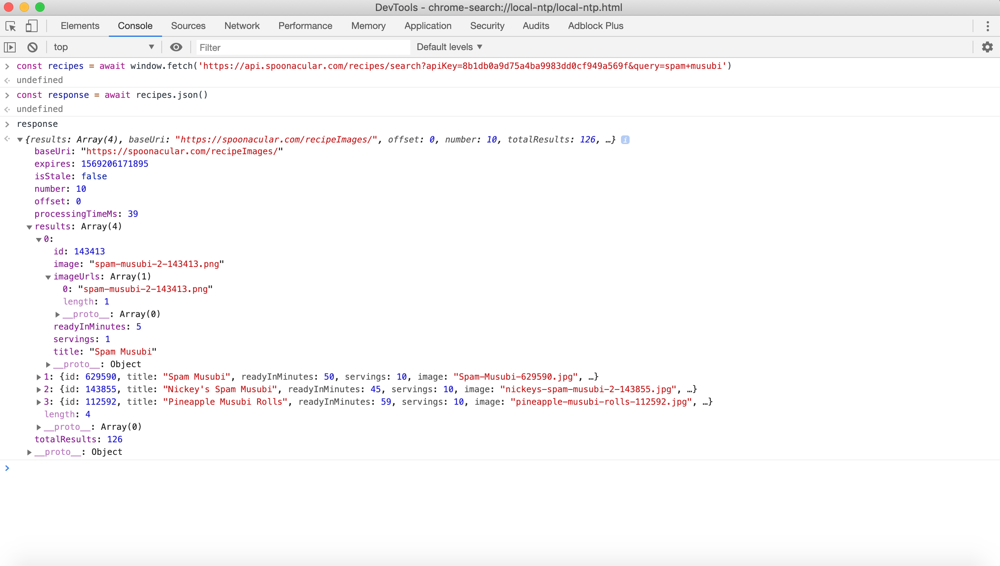
*A simple query using window.fetch*

Recipes are indexed in a "results" array (the size of the results array for this particular search is 126). Notice how each recipe object (particularly the first result) contains an ID, a title, a cooking time, number of servings, an image, and an image URL.

Except for the ID, all of such properties will be needed to display the recipe to the user. In terms of implementation, the ID property serves a very useful function. It may be used in other endpoints to retrieve a recipe's ingredients and nutrition. Note that with a Javascript expression, we could access the ID with `<response variable>.results[0].id`. This is generally how the data may be accessed within this endpoint.

## View
Once the recipe is chosen, a call to get the recipe info can be made using the **GET https://api.spoonacular.com/recipes/{id}/information** endpoint. The first result of the previously made query will be used as an example. 

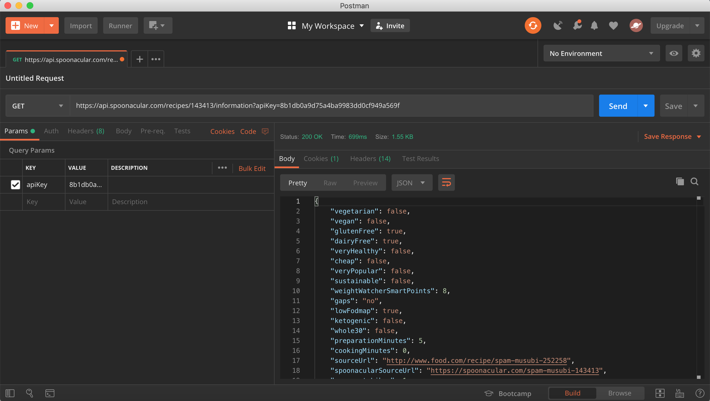
*Recipe information obtained via Postman*

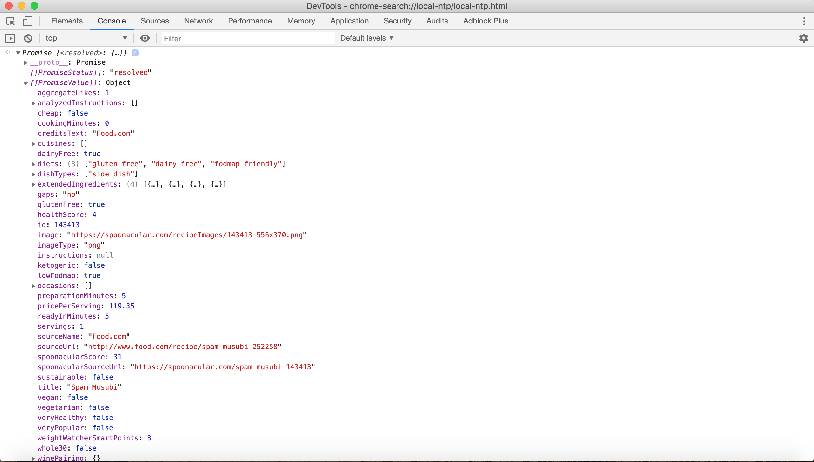
*Recipe information obtained via window.fetch*

As can be seen, a vast amount of information is received. Key information that will be displayed includes the analyzed instructions for the recipe and a health score for nutritional purposes. Data for the recipe's ingredients and nutritional facts are not found in the recipe information response. This is why a call to **GET https://api.spoonacular.com/recipes/{id}/ingredientWidget.json** can be made for ingredients. To retrieve nutrition facts, we can call the **GET https://api.spoonacular.com/recipes/{id}/nutritionWidget.json** endpoint.

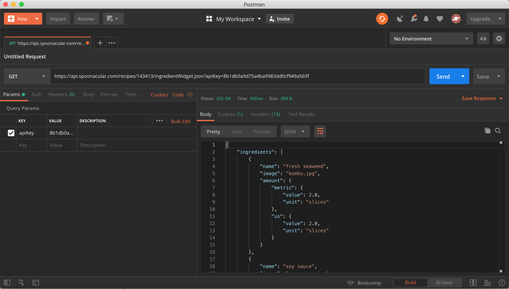
*Parsable ingredients obtained via Postman*

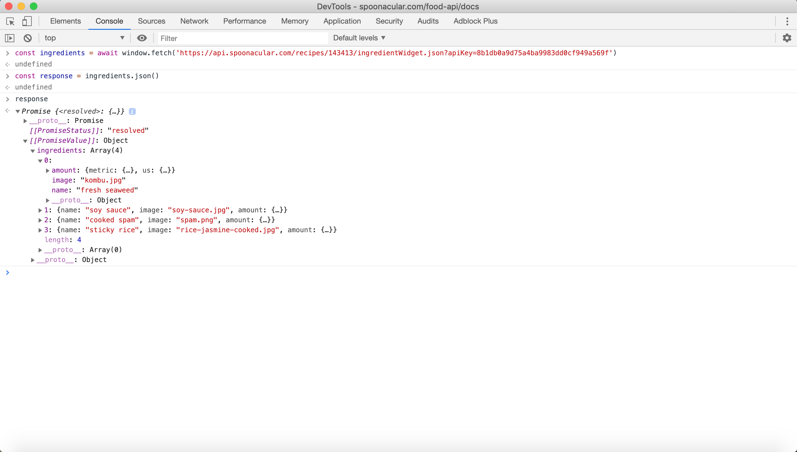
*Parsable ingredients obtained via window.fetch*

Ingredients are stored in an array. Each ingredient has a "name" and "amount of" property that could be displayed for the user. Both will be used in the web application.

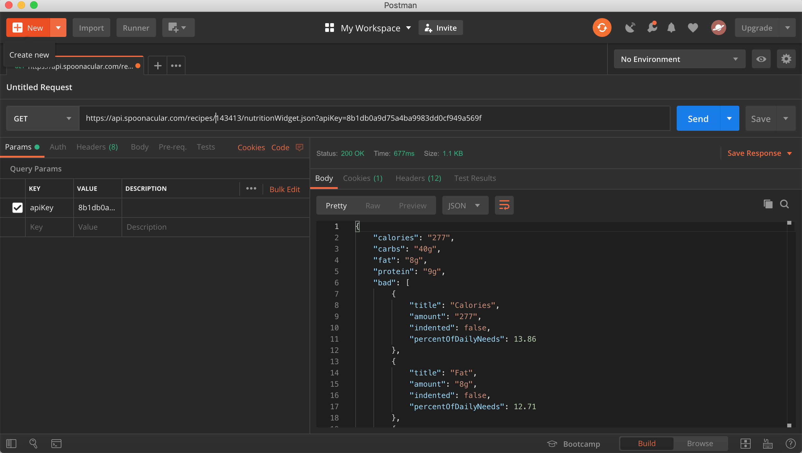
*Parsable nutrition facts obtained via Postman*

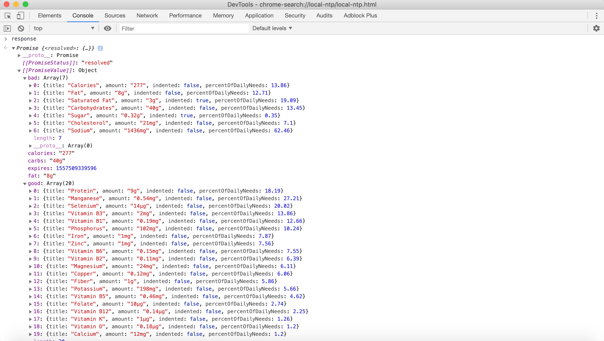
*Parsable nutrition facts obtained via window.fetch*

Interestingly, nutrient objects are stored in two separate arrays labeled "good" and "bad". Expressions to retrieve crucial nutrition data will have to utilize both arrays. Furthermore, many nutrition facts may not be relevant to the common user (i.e. how many micrograms of selenium are in the recipe). Nutrients that will be used are those that could be found on a standard nutrition facts label. Each nutrient object contains information for the amount and percent of daily needs. These attributes are useful and will be included in the information that the user sees.

## Plan
Like all of the aforementioned endpoints, generating a meal plan through **GET https://api.spoonacular.com/recipes/mealplans/generate** is straightforward. The endpoint accepts optional parameters for a daily calorie target, a special diet, and what foods to exclude. If arguments are not supplied, the endpoint returns a random meal plan.

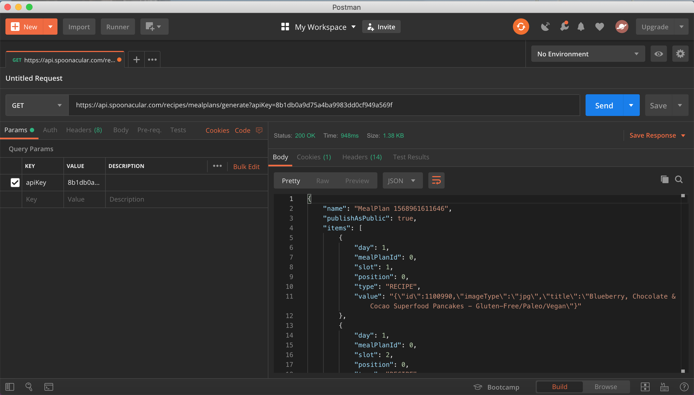
*A random meal plan generated using Postman*

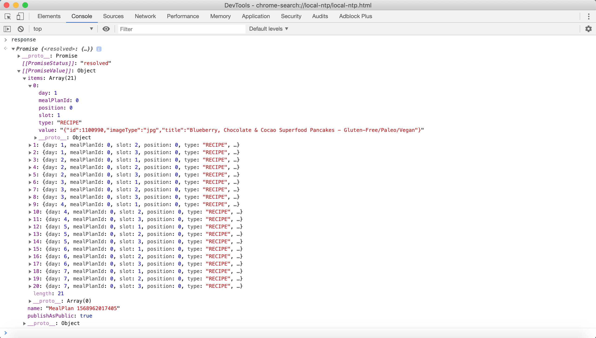
*A random meal plan generated using window.fetch*

A meal plan object contains an array of 21 elements (21 meals in a single week -- that is, 3 meals per day); for clarity, notice how the first element is breakfast for the first day of the week. Each element contains a value string that is a parsable object. From this object, we may use the recipe ID to obtain information for the user.

If the user were to supply arguments to customize their meal plan, the data returned is structurally the same. The only difference is that the results are refined. As an example, we will supply the following: 

`targetCalories = 2150`; `diet = vegan`; `exclude = eggplant, cabbages`

The endpoint processes these arguments and returns a closely matched result.

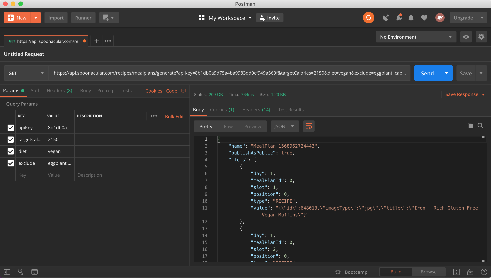
*A custom meal plan generated using Postman*

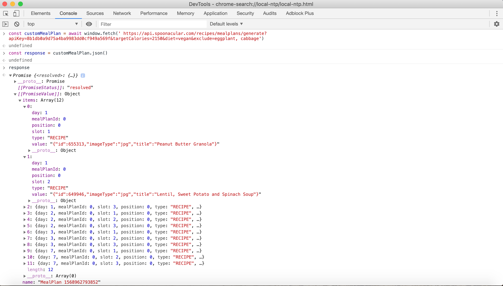
*A custom meal plan generated using window.fetch*

## Errors
No errors were encountered when using the API. The only error was by the user in the form of typos or syntactical forgettings with Javascript.