# Recipes: Spoonacular API Front-End

## Application Description
Users with a busy lifestyle often resort to "eating out." Eating out on occasion isn't intrinsically wrong. However, it has been found that eating out poses the risk of caloric surpluses and lower micronutrient intake1*([Obesity Reviews](https://onlinelibrary.wiley.com/doi/full/10.1111/j.1467-789X.2011.00953.x), 2011)*. In addition to poorer dietary quality, those who spent less than an hour preparing food at home experienced significantly higher costs. A key problem is the prioritization of convenience2 *([American Journal of Preventative Medicine](https://www.sciencedirect.com/science/article/pii/S0749379714004000), 2014)*. True, there are many resources such as recipe search engines that enable users to cook a plethora of meals at home. But some gaps hinder the convenience of such resources:

**Gap 1) Instantaneous Planning.**
*Those who wish to cook at home face the burden of planning what/when to eat, what to purchase, where/when to shop, etc. This requires an immense amount of both creativity and time as weeks progress for those who enjoy a wide array of cuisines; cooks will inevitably run out of ideas.*

**Gap 2) Nutritional Breakdowns.**
*Health-conscious cooks struggle to view a nutritional breakdown of any given recipe. Users could benefit from access to an overview of the nutritional benefits/drawbacks of a meal.*

To remedy the aforementioned gaps and promote healthier eating at home, a traditionally styled web application will be designed with the following features:

**Feature 1) Search and Filter.**
*Users may conduct complex natural language searches for recipes with an option to specify intolerances. Thanks to filtering, searches may be specific or broad (i.e. "Japanese foods", "recipes containing Spam®", "vegan recipes", etc.). If the user does not know what to search for, they may explore by generating a random recipe.*

**Feature 2) Relevant Information.**
*Each recipe page will include a breakdown of the instructions, ingredients, and nutrition.*

**Feature 3) Meal Plan Generation.**
*Rather than having to manually create a weekly meal plan, adventurous users can simply click a button and have a random meal plan generated. The meal plan would include seven days' worth breakfast, lunch, and dinner recipes.* 

### Web Service(s) Used
The web application will be traditionally designed using HTML5, CSS, and Javascript. The application will be a front-end implementation of the Spoonacular API. Full documentation for API may be found at the [Spoonacular API website](https://spoonacular.com/food-api/docs).

The following endpoints will be used:

**Feature 1) Search and Filter**
* **Search: GET https://api.spoonacular.com/recipes/search**  
*Parameters that may be used with these endpoints include query (the natural language input supplied by the user), cuisine (one or more), diet, intolerances, included/excluded ingredients, and more. This endpoint returns a recipe object (object is described in the Relevant Information service).*

**Feature 2) Recipe Data**
* **Recipe Information: GET https://api.spoonacular.com/recipes/{id}/information**  
**Nutrition Information: GET https://api.spoonacular.com/recipes/{id}/nutritionWidget.json**  
**Ingredient Information: GET https://api.spoonacular.com/recipes/{id}/ingredientWidget.json**    
*The recipe information endpoint returns a recipe object with a plethora of information. Information that is returned for display includes: instructions, time to complete, number of servings, ingredients, health scores, taste ratings, and a cost. The nutrition information endpoint returns an HTML formatted breakdown of the nutrients found in a given recipe. The ingredient information is the same as the nutrition endpoint, except it retrieves a recipe's ingredients.*

**Feature 3) Meal Planning**
* **Generate Meal Plan: GET https://api.spoonacular.com/recipes/mealplans/generate**  
*The user may specify their meal plan timeframe (one day or a week), their daily caloric target (i.e. "2100 calories per day"), diet (i.e. "vegetarian"), and ingredients to exclude (i.e. "oysters"). This endpoint will return a meal plan that closely meets the user's specifications.*

## Top-Level Design/Layout
In following a minimalistic approach to design (and for the lack of a better name), the web application will be titled, "Recipes." The goal of the site's design is simple: to not overwhelm the user. This can be accomplished through layout simplicity. Such an approach leverages the following: intuitive diagrams supplied with text to guide the user through an interface; interactions aside from clicking (i.e. scrolling, hovering, etc.); and an aesthetic presentation of text. The overall layout of the site can achieve simplicity by narrowing the scope of material down purely to functionality. In other words, the web application has only two main functions: to "find"/"view" a recipe and to "plan" recipes for use in advance.

The home page is designed to introduce the user to the site's structure. A logo, menu, and navigation instructions are exclusively displayed. Nothing more, nothing less.
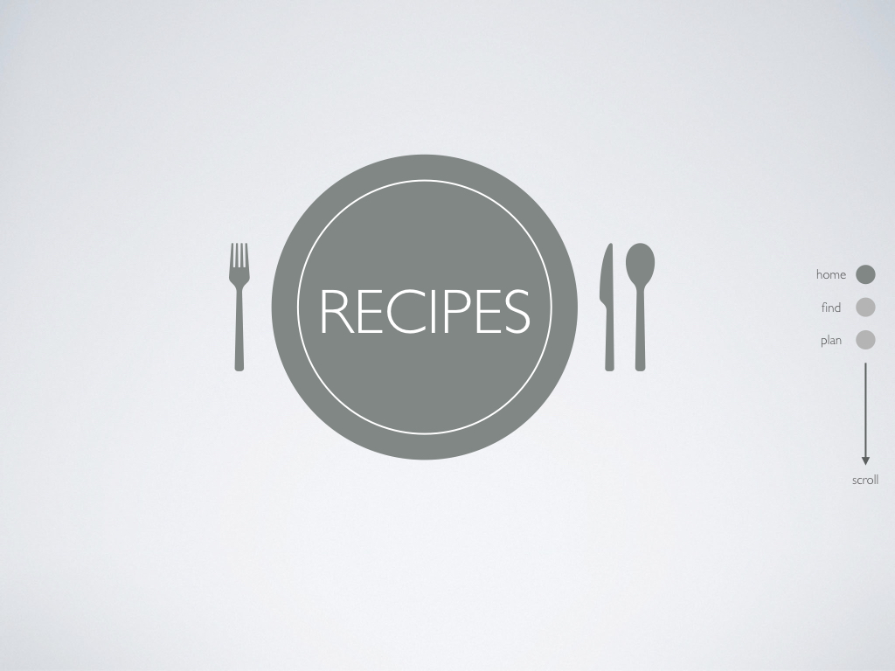

In describing the other functions and their designs, two usage scenarios will be discussed.

## Usage Scenarios

### Scenario 1) Searching for a Spaghetti Recipe
To retrieve a recipe, the user will only have to do the following: reach the "find" page, input a natural language query, choose a desired result, and view the recipe! Relevant interface elements and how the user performs this task will now be discussed in further detail with images.

The user may scroll down to the first feature: "find." A search bar is displayed. The user may input a natural language query to retrieve the desired results. Filtering is applied via the query without the use of buttons.   
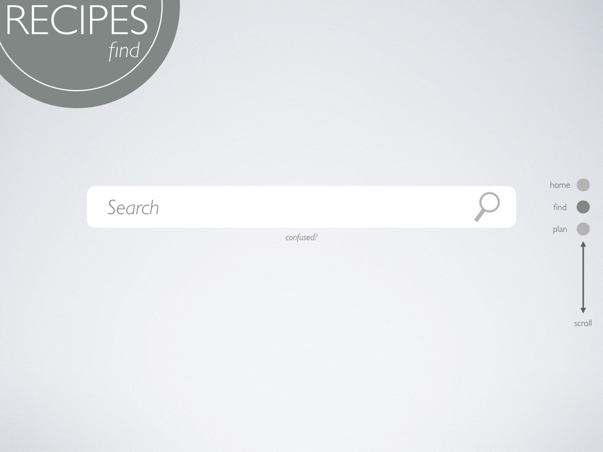

If the user is unsure of what they ought to search, they may hover over the phrase, "confused?" and a brief set of instructions/examples will appear.  
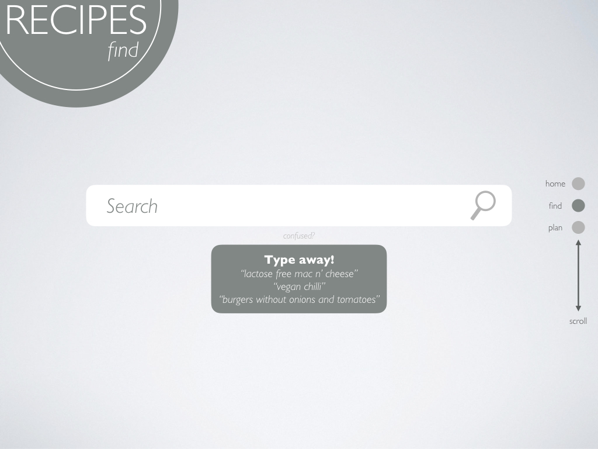

Upon entering an input, the first five results that closely match the query are displayed. Any result may be clicked to view the referenced recipe.  
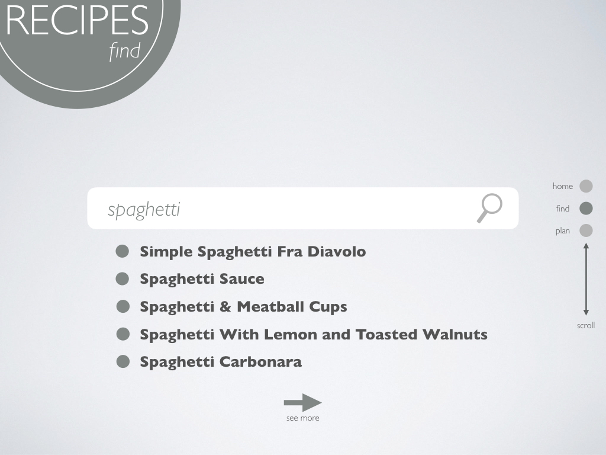

If the user desires to see more results, they may click the "see more" prompt. Scrollable results are then displayed. Notice how the function of scroll needs to change from feature toggling to result perusal. To keep the option of toggling a feature available, the menu position is moved to the bottom right of the screen. It would be triggered via clicking.  
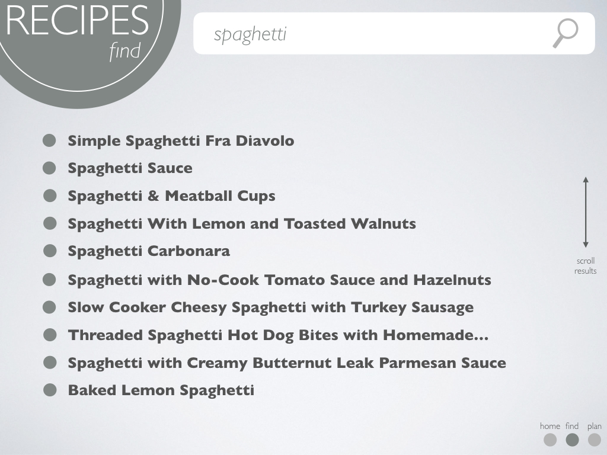

When hovering the pointer over a result, a highlight of the result appears to communicate that the said result can be clicked. Once the result is clicked, the user is transferring to a viewing of the recipe. If desired, the user may easily return to their search by clicking "back to search" at the bottom left corner.  
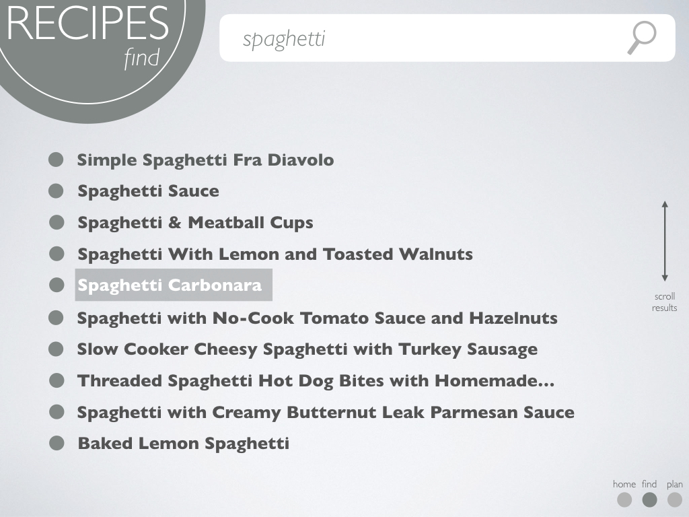

The recipe clicked will have three sub-parts for view: "ingredients", "steps", and "nutrition". Sub-parts may be reached via scrolling. On each sub-part, notice how the arrow's directions will correspond to another reachable sub-part. The ingredient list is fairly straightforward as it only displays the items and their amounts. Images of the items are available via the API, however, the quality and background of the images may harm the aesthetic appeal of the application. Hence, it was decided that the images wouldn't offer any additional improvement to the user experience.  
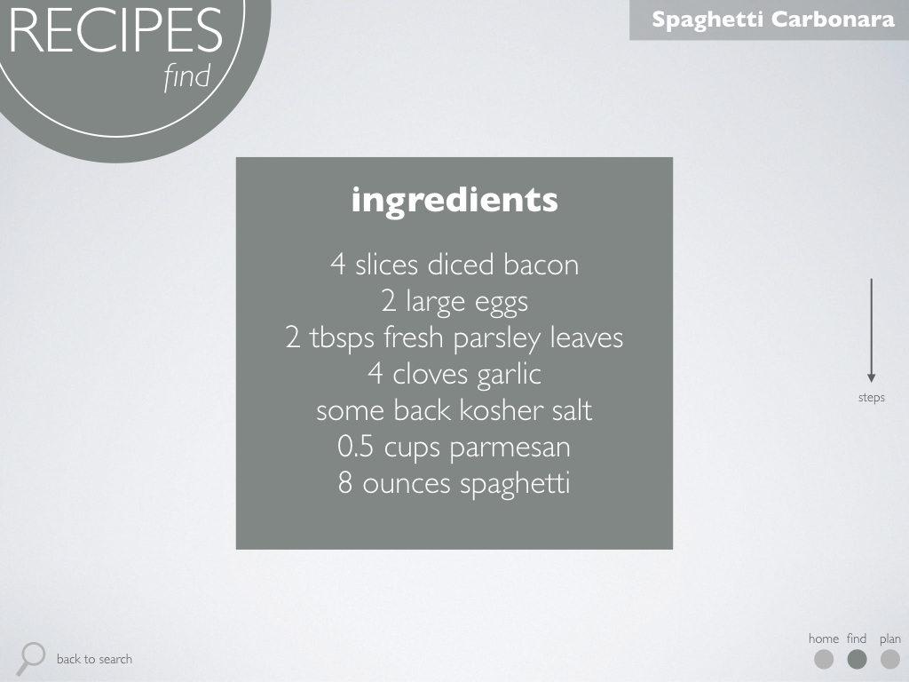

Steps may be viewed in a sequential manner similar to slides or a set of flashcards. To see the next instruction, the user may click the "next step" button.  

Steps whose index is greater than 1 will feature a "previous step" button. Self evidently, the button allows the user to review a previous if necessary. At any time, the user may scroll on to the nutritional information if desired without having to review all steps for a given recipe.  
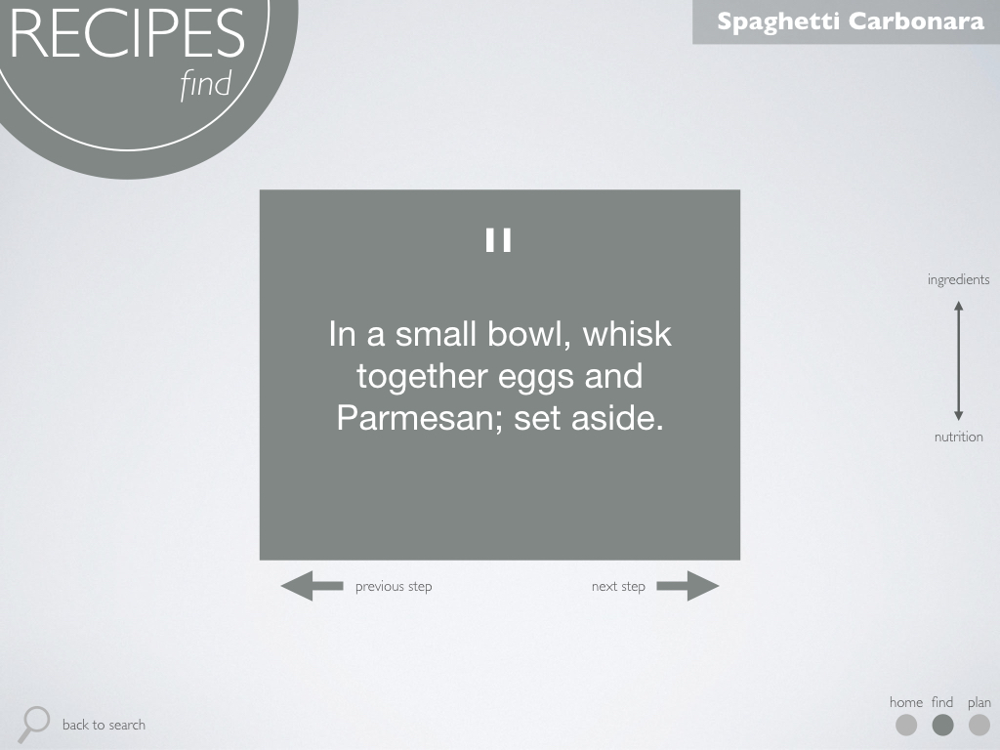

It is difficult to portray nutritional in a simplistic manner that adheres to the application's aesthetic. This is because such info is dependent on a larger amount of letters, numbers, and symbols. To keep the information organized, the portrayal table is ordered per a standard "nutrition facts" label on food products.  
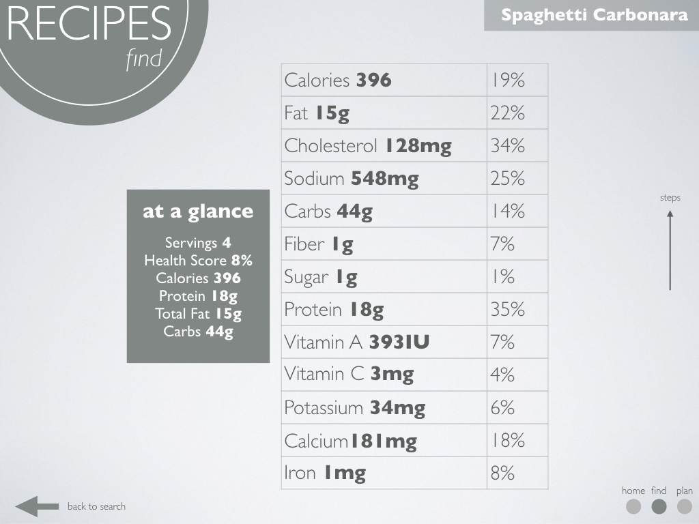

### Scenario 2) Planning a Week's Worth of Meals
In creating a meal plan, the user is provided with enough flexibility to adapt a plan to their liking. Users only need to perform the following tasks: navigate to the "plan" page, choose to either customize or receive a random meal plan. If the opts to customize, they enter as much or as little information. Finally, they may review their meal plan and click any of the recipes displayed for a particular meal.

The planning page depicts a week-long calendar of three meals (B for Breakfast, L for Lunch, and D for Dinner). A user may randomly generate a meal plan or customize a few attributes.  
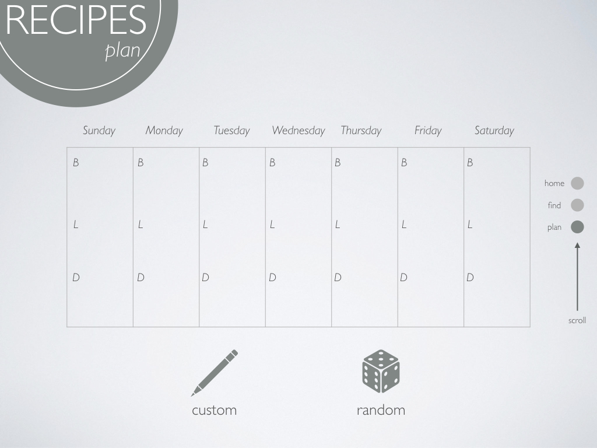

To create a custom meal plan, a user may input in any or all of the following fields: "Daily Calories" (how many calories the user wishes to consume in a day), "Diet" (i.e. vegetarian, vegan, keto, etc.), and "Exclude" (a comma-separated list of food items). If the user inputs nothing, a random meal plan will be generated.  
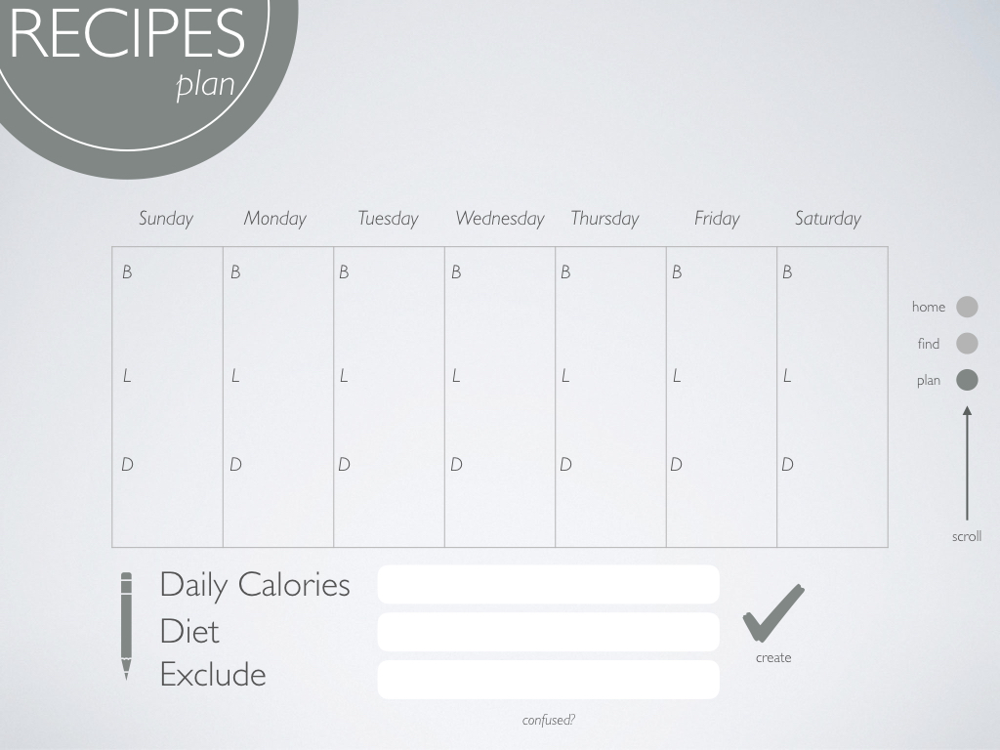

If necessary, the user may hover their pointer over "confused?" to receive brief examples of possible inputs.  
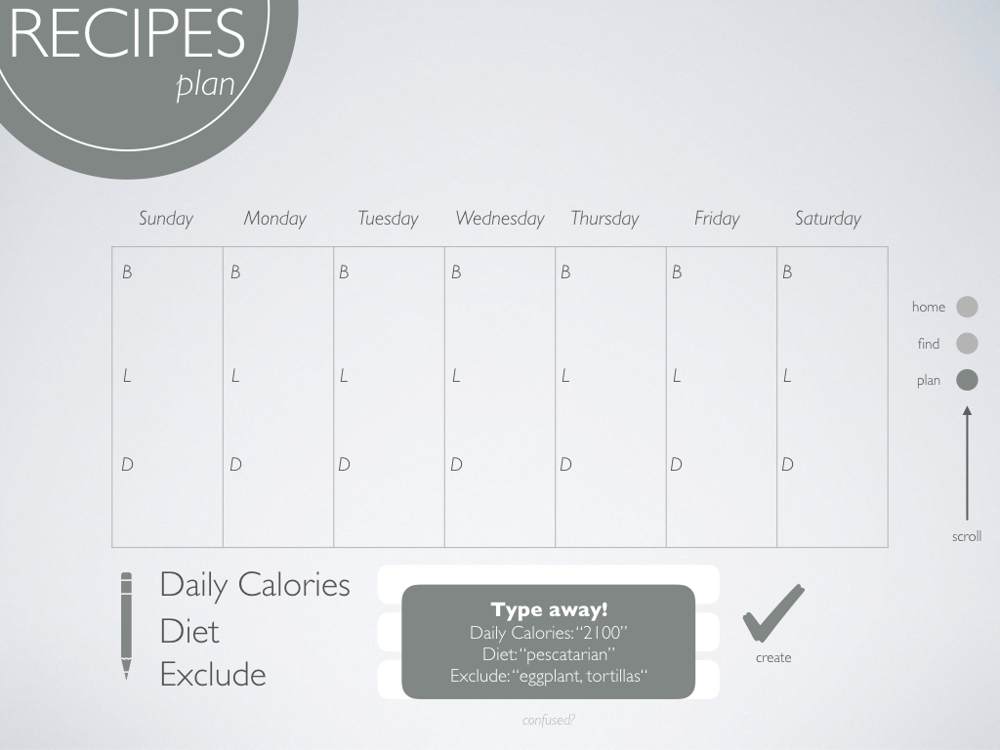

Once the meal plan is generated, it will be displayed with recipes as clickable links. It is difficult to guarantee a perfect caloric plan that meets user specifications. Thus, an average of the calories consumed per day is displayed for reference. If the user is unhappy with the results, they may click "redo" to re-generate a plan using the same specifications.  
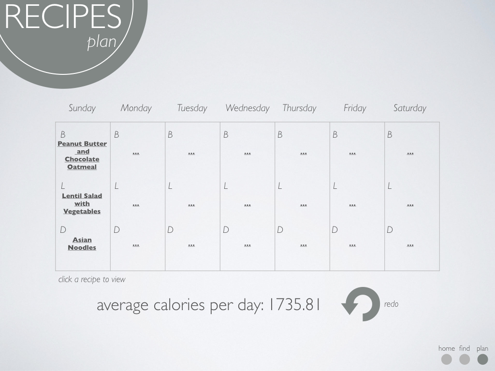

## Design Rationale
The fundamental goal of the interface design is to not overwhelm the user. The programmer's mental model is simple functionality with little to no hindrances. For example, many sites will tend to apply filters through a wide array of buttons that the user must toggle. This method is overwhelming and thus, hindering; the user cannot seamlessly experience the benefits of a site's function. In discussing the rationale for the web application's design, the following elements will be explored: "Organization", "Accessibility", "Navigation", "Input/Data Entry", and "Usability".

### Organization and Data Entry  
Widely cited objectives for organization and data entry were published in a technical report entitled, "Guidelines For Designing User Interface Software." According to the report, there are five objectives:

> "Consistency of data entry transactions; Minimal entry actions by user; Minimal memory load on user; Compatibility of data entry with data display; Flexibility for user control of data entry."3 *([Smith and Mosier](www.idemployee.id.tue.nl/g.w.m.rauterberg/lecturenotes/DA308/MITRE(1986)smith-mosier.pdf.), 1986)*

* **Consistency of data entry transactions**  
All fields where text entry is needed utilizes natural language processing. Buttons are not used. This remains consistent throughout the entire application.

* **Minimal entry actions by user**  
The user only needs to supply entries for key functions: finding and planning. Even with such entries, the data supplied by the user is minimal and requires little effort.

* **Minimal memory load on user**  
Users do not have to memorize a sequence of procedures to carry out their tasks on the application. Any interaction with the application is supplied with instructions and/or examples. Furthermore, through diagrams, the site ought to be more simple and intuitive.

* **Compatibility of data entry with data display**  
The format of information received through a query is closely matched to the user's input. The same principle applies to meal planning inputs.

* **Flexibility for user control of data entry**  
Where there is an ability to customize, users are enabled. This is especially true for meal planning functions. The use of natural language in querying recipes also helps the user to intuitively input data in expectation of a result.

### Accessibility  
The World Wide Web Consortium (W3C) published a variety of guidelines for HTML content. Out of many, three particular guidelines will be implemented. 

> “Provide a text equivalent for every non-text element...”4 *([W3C](www.w3.org/TR/2000/NOTE-WCAG10-HTML-TECHS-20001106/), 2000)*

The site is very diagrammatic. Notice from the images shown earlier how every diagram is supplied with a textual description. Additionally, the same function would be performed regardless of whether the user clicks the text or diagram.

> "Title each frame to facilitate frame identification and navigation...”4 *([W3C](www.w3.org/TR/2000/NOTE-WCAG10-HTML-TECHS-20001106/), 2000)*

As depicted in the Top-Level Design/Layout section of this document, there are titles for all pages. This allows the user to maintain a sense of bearing as they navigate the application.

> "Ensure that all information conveyed with color is also available without color..."5 *([W3C](www.w3.org/WAI/wcag-curric/sam25-0.htm), 2000)*

The neutral colors of the application are not purely aesthetic. They serve a function of inclusivity for those who may have color deficits. Attention is exercised towards ensuring adequate contrast for all site elements.

### Navigation  
The U.S. Department of Health and Human Services has an entire site dedicated to standards and usability guidelines. In it, two standards were considered when designing the application's mockup.

> “**Standardize task sequences.** When describing an action or task that has a natural order or sequence (assembly instructions, troubleshooting, etc.), structure the content so that the sequence is obvious and consistent”6 *([U.S. Department of Health and Human Services](https://webstandards.hhs.gov/guidelines/87))*

Virtually every action is 100% immutable and consistent. The only mutable action is scrolling. Scrolling is utilized for two purposes on the site: switching to a new page and perusing data. This does pose a problem for standardization as the former is associated with menu navigation while the latter is content navigation. In an attempt to standardize, the navigation menu will be located in either the bottom right corner or right-center. The slight inconsistency does bolster the navigability of the application. When the menu is in the bottom right corner, it signals that scrolling will serve a new function: viewing results. Otherwise, when the menu is at the center-right of the screen, scrolling would allow switching between site pages.

> “**Use unique and descriptive headings.** Use headings that are unique from one another and conceptually related to the content they describe.”6 *([U.S. Department of Health and Human Services](https://webstandards.hhs.gov/guidelines/14))*

### **Usability**
Nielsen suggests ten heuristics for usability7 *((Nielsen)[https://ebookcentral.proquest.com/lib/lmu/detail.action?docID=1190977#], 1994)* In creating the web application, it is a goal to implement each heurstic if applicable.

**1) "Simple and natural dialogue"**
This idea is implemented by not displaying more than is necessary. Text is minimized to only provide relevant and useful information.

**2) "Speak the users' language"**
Words, phrases, and pictures speak to the user and are descriptive.

**3) "Minimize users' memory load"**
This heuristic was discussed under considerations for organization and data entry.

**4) "Consistency"**
This heuristic was discussed under considerations for organization and data entry, accessibility, and navigation.

**5) "Feedback"**
Users may not have to be informed on updates as the site may not be updated. However, feedback on the usability of a site is always accepted.

**6) "Clearly-marked exits"**
This will be implemented in the form of an ever-present navigation menu and "go back" buttons.

**7) "Shortcuts"**
The problem with scrolling interactions is that it generally requires the user to travel through an array of irrelevant content before reaching their destination. Clickability will be a possibility so that users may skip and use the site more quickly.

**8) "Good error messages"**
Errors are most likely to occur with queries. Error messages will be displayed in concise and understandable English without any programming vernacular.  

**9) "Prevent errors"**
In general, the Spoonacular application programming interface ought to handle most exceptional cases. 

**10) "Help and documentation"**
Help is offered in the form of bubbles or one-liner instructions for all interactions that the user may utilize. 

## Usability Metric Forecast
The minimalism that will be implemented on the site ought to aid in Nielsen's usability metrics: learnability, efficiency, memorability, errors, and subjective satisfaction.7

### Learnability
The application will excel in this metric. The interface is not overwhelming, diagrams/instructions are descriptive, and data is organized for easy reading. Another point of consideration is how many senses the user may interact with the site. Scrolling, clicking, and typing are exclusively the only methods for interaction (flicking, speaking, etc. are other possible methods that are not used). These interactions are common to any computer user. Hence, the interactions are transferrable from any other application/program that the user encounters and are easily learnable.

### Efficiency
To maximize efficiency, the site will be streamlined in three senses. First, users will not be bombarded with constant prompting; second, shortcuts are available to reach content faster (discussed in usability considerations); and third, the site is purely limited to functionality (there will never be extraneous information displayed).

### Memorability
The learnability of the site influences how well a user would remember its abilities. With the implementation of commonly used interactions, users should not have a difficult time remembering how to use the site. Moreover, the site's graphical interface is simple enough to not overwhelm the casual user. It may be argued that the site is easy to memorize as a result of such simplicity.

### Errors
As stated earlier in the usability design rationale, the only real errors that may occur are a result of bad queries. The application will generally avoid error as it is limited in the scope of functionality that it provides.

### Subjective Satisfaction
The aesthetic of the site caters to subjective satisfaction very heavily. While appealing and clean, the design may have the drawback of users feeling as if there isn't "enough" information being given. This may not necessarily be the case as there is plenty of data (it's just portrayed minimally). However, it is of concern.

## References
[1] Lachat, C., et al. “Eating out of Home and Its Association with Dietary Intake: A Systematic Review of the Evidence.” *Obesity Reviews*, no. 4, 2012. EBSCOhost, search.ebscohost.com/login.aspx?direct=true&db=edsgao&AN=edsgcl.283182760&site=eds-live&scope=site.

[2] Monsivais, Pablo, et al. “Time Spent on Home Food Preparation and Indicators of Healthy Eating.” *American Journal of Preventive Medicine*, vol. 47, no. 6, Dec. 2014. EBSCOhost, DOI:10.1016/j.amepre.2014.07.033.

[3] Smith, Sydney L, and Jane N Mosier. GUIDELINES FOR DESIGNING USER INTERFACE SOFTWARE. *The MITRE Corporation*, 1986, pp. 24–24, GUIDELINES FOR DESIGNING USER INTERFACE SOFTWARE, www.idemployee.id.tue.nl/g.w.m.rauterberg/lecturenotes/DA308/MITRE(1986)smith-mosier.pdf.

[4] “HTML Techniques for Web Content Accessibility Guidelines 1.0.” Edited by Wendy Chisholm et al., HTML Techniques for Web Content Accessibility Guidelines 1.0, *World Wide Web Consortium*, 6 Nov. 2000, www.w3.org/TR/2000/NOTE-WCAG10-HTML-TECHS-20001106/.

[5] “Example for Checkpoint.” Examples: WAI Web Content Accessibility Curriculum - Slide "2.1 - Ensure That All Information Conveyed with Color Is Also Available without Color, for Example from Context or Markup.", *World Wide Web Consortium*, 2000, www.w3.org/WAI/wcag-curric/sam25-0.htm.

[6] U.S. Department of Health and Human Services. “Usability Guidelines: These Guidelines Are Research Based and Are Intended to Provide Best Practices over a Broad Range of Web Design and Digital Communications Issues.” Usability Guidelines: These Guidelines Are Research Based and Are Intended to Provide Best Practices over a Broad Range of Web Design and Digital Communications Issues., *United States Department of Health and Human Services*, webstandards.hhs.gov/guidelines.

[7] Nielsen, Jakob. Usability Engineering: Usability Engineering, Elsevier Science & Technology, 1994. *ProQuest Ebook Central*, https://ebookcentral.proquest.com/lib/lmu/detail.action?docID=1190977.
