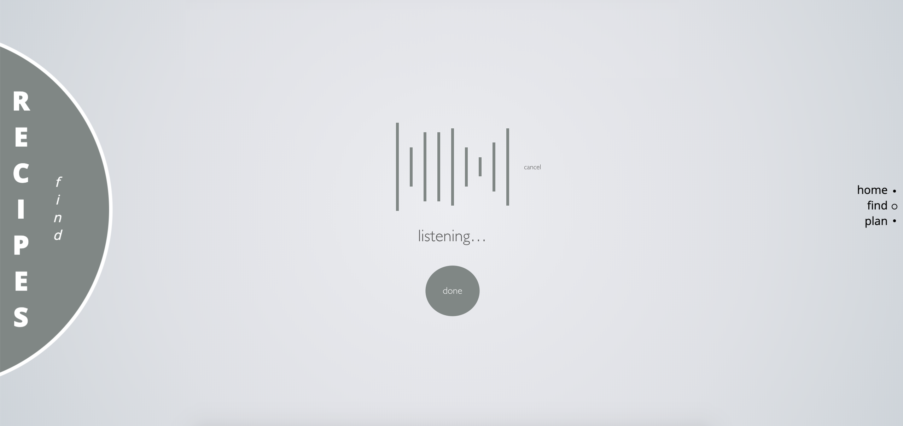

# Front-End Evaluation and Design Vision Document

## Introduction
"Recipes" is a web application designed to be simple. That is, the user is presented with only relevant information accessible via simple tasks. The ultimate goal of the application is to make meal planning and preparation quick, convenient, and simple. Recipe data is retrieved via the Spoonacular API. The application utilizes traditional web services including HTML5, CSS, JS, and JQuery to provide the following functionality: search, plan, and view. 
* **Search**  
Self-evidently, searching is used to find a particular recipe. Natural language queries are processed by a Spoonacular endpoint. The endpoint returns a set of recipes closely matching the query. 
* **Plan**  
The planning feature simply allows a user to generate a week's worth of meals (breakfast, lunch, and dinner). This is performed by the simple click of a button.
* **View**  
A user may view key information about any given recipe. This includes a sample image, ingredients, preparation/cooking steps, and a rudimentary nutritional breakdown of calories, fat, protein, and carbohydrates. 

## Evaluation
Evaluation of the application's usability is based upon the experiences of five unique users. To get a gauge on the user's experience, I first inquired about their proficiency in interface knowledge and domain knowledge. For interface knowledge, three of the users considered themselves to be "experts" while two claimed to be knowledgable-intermittent. For domain/task knowledge (in the field querying), three users considered themselves to be expert-knowledgable while the rest were competent-knowledgable. 

Overall, the design of the application appealed to all users. However, there were recommendations for more prompts and "how-tos" to be available within the application. The following sections (Heuristic Evaluation and Usability Metrics) will explore these concepts from the perspectives of interaction design guidelines and principles.

### Heuristic Evaluation
In this section, the following concepts will be explored: a comparison of user/programmer mental models, and whether the application connects the two models; the application's adherence to guidelines and principles of human-computer interaction; and the effectiveness/appropriateness of interaction styles used in the application.

#### Mental Model
As stated in the introduction of this document, the goal of the application is to provide quick, convenient, and simple access to meal planning and preparation. This is accomplished through an interface design that promotes consistency and simplicity to not overwhelm the user. From a mental model standpoint, I envisioned a simple and "natural" functionality. Natural functionality may be defined through the Object-Action Interface Model1. This model anatomizes the real world into objects and actions. Applying this to the interface design, it is clear that the system's images (objects) are manipulated by the user through tasks (actions). Since users acquire task knowledge through everyday experiences, they attempt to map their understanding of objects and actions to the computer interface. For example, with Google, users are not typing formal computer commands to query the indexes of the world wide web. Rather, they are speaking to the interface as they would ask a question to someone they deem to be knowledgable in the matter (i.e. "What will the weather be tomorrow?"). Hence, natural functionality may be understood to be a sequence of tasks that the user is familiar with and may apply to a computer interface. This application draws inspiration from these theories as demonstrated by the natural language search feature. 

Rather than be overwhelmed by a variety of buttons that apply filters (i.e. "vegan" or "exclude lettuce"), the user may simply engage in a dialogue with the application using words that they would in a normal conversation (a real-world task that the user is familiar with).

The system's image communicates this model of natural functionality by only displaying a search bar. In theory, this ought to prompt the user for a phrase -- a question -- that will give them an answer they seek. For most users, it was clear (through exploration) that they could simply input searches using inclusionary/exclusionary language to filter results. Two user's commented on how it would be helpful if there were a prompt explaining how search queries may be structured; they were unsure of whether they may map their experiences with other applications (AllRecipes, Pinterest, etc.) to this application. Considering that the two users were both under the category of "expert" for interface knowledge, it is clear that the system image could improve how it communicates the programmer's mental model. A quick fix may be explicit instructions for users that is optionally displayed. This fix was actually in the initial design document as a mockup (see below images for reference). This feature wasn't implemented as a result of work in trying to get the Spoonacular API to work.

By hovering over the phrase, "confused?", the user is presented with sample queries that convey how searches may be conducted.

When shown these images, both users agreed that, had this feature been implemented, there would have been less of a gap between their mental model and the programmer's. That is, they would have utilized their previous experiences with natural language searches in this context. Note that this analysis applies to usability metrics. It will be elaborated upon further in this document.

#### Adherence to Guidelines and Principles
Of Ben Shneiderman’s Eight Golden Rules for Human–Computer Interaction2, two rules were most relevant to the comments received:

*1) Strive for Consistency:*  
Consistency in the context of interaction design ensures that, a) Terminology is identical for all menus, alerts, and anything requiring user command; and b) Similar tasks have similar (if not the same) sequences of actions. All users claimed that the application upheld consistency in both respects. They had no additional feedback to offer. This is attributable to the modality-like structure of the site that reduces user error and allows users to use recognition instead of recall. The theory surrounding this idea was discussed in the previous section.

*2) Permit Easy Reversal of Actions:*  
The reversal of actions is, quite simply, the ability for a user to "undo" something. With this ability, a user may return to a previous state of the application. A notable comment received in this area was that once a recipe is selected and viewed, the user cannot return to their inputted query; rather, when they return to the previous page, everything is reset. This is a result of not leveraging techniques to override the inherent nature of the traditional web technologies (inherent natures being how pages are reset when a user presses the browser's "back" button). Hence, the application could leverage improvements in this area. 

#### Effectiveness/Appropriateness of Interaction Styles
The application features two forms of interaction styles: Form Filling and Modality. 

**Form Filling**  
Implementation of the form filling style is seen in the "search" feature of the application. Analysis presented on this feature may be seen as further support of the points presented in the Mental Model evaluation and implementation of the search feature. There are five guidelines3 worth noting in describing the effectiveness/ineffectiveness of this interaction style:

*1) Instructions:* as explained in the Mental Model evaluation, the simple use of explicit instructions would have cleared up the confusion concerning how the user may interact with the search form. However, implicitly, the mere appearance of the form allowed users to explore and experience how the form works. This concept of exploration will be discussed further in an assessment of learnability within the Usability Metrics section.

*2) Visual Appeal:* none of the users had any qualms or criticisms regarding the layout. Additionally, they found the use of a search form to be appropriate given the functionality of the search feature.

*3) Familiar Labels/Consistent Terminology:* the terminology of the labels was clear and communicative of the form's purpose. One comment received was that the feature is titled "find" on both the menu and page while the search bar has a placeholder of "search" within the bar. They recommended that the name be made consistent.

*4) Error Correction:* this was not implemented at all in the development of the application. When one user had a typo in their search, results still spawned, but were not as closely matched to their intentions.  

*5) Feedback for Unacceptable Values:* when performing an error prone query, the users received no results. This was expected by most of the users. A few commented how an error message would have been useful.

**Modality/Menu Selection**  
While, as a general rule, modality is not recommended for applications4, a type of this style was implemented within the application. Each page presents a different set of functionality and information (essentially acting as unique modes). In furtherance of this point, a user must scroll to a new page to plan a week's worth of meals or view the nutritional breakdown of a recipe. Put simply, each mode is a menu item that appears on the right side of the screen (see image below).

There were two objectives to this style: 1) Reducing errors by limiting user autonomy; and 2) Promoting clarity in what sequence of tasks a user should perform to accomplish a goal.

The goals were accomplished for all users, no exceptions. When asked how to see the ingredients for a taco recipe, the user correctly identified the sequence of tasks to be performed. Theoretically, this may be because the set of modes available provided a sense of organization for what tasks are relevant to the user's intention. Moreover, the menu styles for the modes allowed users to rely on recognition instead of recall (though they could recall with accuracy).

### Usability Metrics
The following metrics, as derived from Nielsen's *Usability Engineering*, will be explored: Learnability, Efficiency, and Subjective Satisfaction5.

#### Learnability
"The site is extremely easy to learn and remember...I would've learned it faster had there been more hints." This remark by one of the user's sums up the fundamental gap that stands between the programmer/user mental models. Right off the bat, all but one of the users struggled to navigate the application without attempting to ask me (the programmer) a question. Once the home screen was loaded, I instructed each user to navigate to the appropriate page for finding a "home-made cheese pizza" recipe. The user's actions/responses may be surmised by Marchionini's stages of information-seeking6.

1) The users recognized and sought to understand what information problem needed to be solved: they needed to find a recipe for their liking that closely matched home-made cheese pizza.

2) The users had already been assigned a search system -- the application. However, they needed to exercise a sequence of actions to utilize the provided tool. The correct sequence would have been to swipe up (a scroll gesture) to reach the "find" page, use the keyboard to enter a query, then click the search icon or hit "enter" on the keyboard. All of the users recognized that they needed to reach the "find" page, however, four of them didn't know how to accomplish this goal. They attempted to click the menu text and dots located on the middle-right side of the screen to no avail. Eventually, through exploration, they discovered that scrolling was how to perform the task of navigating the website. The application could have helped the user by supporting click functionality along with offering prompts for valid actions. The one user who completed the action sequence had prior experience with such a website interface design (a demonstrable example of the natural functionality concepts discussed earlier). 

3) Most of the users formulated their queries by simply adopting the phrase, "home-made cheese pizza." A couple formulated simpler queries without limiters such as "home-made" or "cheese."

4) All of the users were familiar with how search functionality works on most (if not all) applications. They typed their query in the bar and hit the "enter" key on the keyboard. When asked what they would do to execute a search if the "enter" key did not work, every user affirmed that they would try clicking the magnifying glass icon located on the right side of the search bar. This indicates consistency with other search systems in terms of illustrations used to convey meaning.

5) Once the results were displayed, all of the users had the intuition (attributable to prior experience) that the results were clickable links. They then proceeded to examine the results.

6) Each user had their method for determining the relevance of the results. Most completely discounted looking for "home-made" in the title as evidenced by their selections. When asked why, they answered that if they are preparing the recipe themselves, that it is already home-made. Every user focused on finding a recipe with the word "cheese" included.

7) Upon clicking their chosen result, the users extracted all of the information by scrolling through the pages.

8) Finally, when asked to perform other searches, the users reflected an iterative process of scrolling and entering queries. It was apparent that, once the users understood the scrolling functionality, they could navigate the site seamlessly to accomplish their intentions. Furthermore, as predicted by the Object-Action Interface Model, users attempted to apply their task-knowledge of search to other tasks such as creating a meal plan.

#### Efficiency
As was just mentioned, the learning curve for four of the users was leveraging scrolling for navigation. Once this learning curve was surmounted, users had no problem navigating and using the features of the application; little to no time was needed for the user to "master" the application. This is because the site allows users to recognize rather than recall its structure (highlighted earlier). A few users remarked that the site's efficiency could be improved through shortcuts. Interestingly enough, this is one of Nielsen's guidelines as codified in *Usability Engineering*5. An example of where shortcuts are needed is seen by how users were slightly annoyed by the amount of scrolling needed to reach the nutritional break-down of a recipe from a meal plan; they had to scroll through literally every page of the website! A fix for this problem is simple: hyperlink the page names in the menu. In the context of this example, this would reduce the number of pages seen by a factor of almost 2 (7 / 4 = 1.75; 7 pages seen in the current version divided by 4 pages seen in the new version).

#### Subjective Satisfaction
I asked each user to give a numeric score, on a scale of 1 to 10 of their overall enjoyment of the applications. The average score was (10 + 9.5 + 9 + 9 + 10) / 5 = 9.5.

### Recap
Overall, the key area for improvement for the application is offering more help and shortcuts for the user. This would put the application one step closer towards aligning the user's mental model with the designer's. Regardless, the application performed well in terms of error, subjective satisfaction, learnability, and efficiency. Many improvements could be seen for the application. This document now turns to a vision for an improvement that stands out for its potential to improve efficiency. This improvement has become a popular interaction style for query-based applications and is becoming ever more useful in our digital age. 

## Design Vision
The application could benefit from the implementation of voice control for searching. More clearly, rather than only being able to type a query, the user may speak it. The addition of voice control would follow seamlessly from the mental model discussed earlier in this document. Since the goal of the application is to make meal planning/preparation quick, convenient, and simple through natural functionality, voice search would be a fitting next step towards "upgrading" the application. Discounting the constraints of current mechanisms, voice control is a viable option for easy to learn functionality; it accommodates a plethora of user profiles that diverge in interface and domain proficiency.

### Top-Level Design/Layout
The new design would simply feature a microphone icon in the search bar. This is the only difference from the current design. When clicked, the device will begin listening.

To inform the user that the computer is listening, the following feedback will be given: a wave diagram that fluctuates with the user's voice and the phrase "listening...". Notice how the user has a clearly marked exit that allows the user to cancel the voice search if they so desire. Furthermore, there is a button labeled "done" that, when clicked, will process the user's input and display it. To prevent user error, if the button is not clicked and there is no user-supplied input for more than 3 seconds, the input would automatically be processed and displayed. This is a similar mechanism to what is implemented in Google search.

It is worth mentioning that the user cannot supply inputs by voice and keyboard simultaneously. Notice how, once the microphone is clicked, the search bar disappears. This is another example of how the app would leverage modality to prevent user error. Such a mechanism is similar to how Google's voice search works (observe how the whole screen is in a "voice search mode"):

Suppose the input is completely incoherent (i.e. the user isn't loud enough). If this error occurs a message will display. The user will have the option to try inputting their query again via voice command.

Suppose the input is coherent. If the "done" button is clicked, or 3 seconds have elapsed (as described earlier), then the input is processed and displayed. Before a search is conducted, the user has the option to redo their query. Otherwise, they may hit the "enter" button on their keyboard, or click on the magnifying glass icon.

Once the input is submitted, the voice input would be processed and search would be conducted. Results will be displayed in the same fashion as the current implementation of the application.

### Usage Scenarios
Two usage scenarios are provided to illustrate a) A sequence tasks that a user must perform to accomplish an intention; b) How the application engages in a dialogue with the user by presenting decisions; and c) How the application responds to interactions. 
 
#### Voice Search for a "Vegetarian Enchilada" Recipe
Suppose that a user wished to search for vegetarian enchilada recipes, but didn't want to go through the hassle of typing. They scroll to the "find" page and click the microphone icon in the search bar. Once the computer is ready to listen, it displays a flat wave with the phrase "listening..." to indicate that the user may speak. "Vegetarian Enchiladas", the user says. The user is sure that the computer heard them because, while speaking, the wave display fluctuated. Instead of waiting for a prompt, they click the "done" button. The computer processes the input and displays the following in the search bar: "Vegetarian Enchiladas". The user is satisfied and hits the "enter" key on the keyboard. Results are rendered for the user's choosing. 

#### Editing an Incorrect Voice Search
Suppose the previous scenario occurs up to the point where the user speaks their query, "Vegetarian Enchiladas." Instead of hitting submit, they wait a few seconds. The computer stops listening and processes the query. Because technology is imperfect, the computer mishears the user and displays "Vegetarian Inches in Lada" in the search box. The phrase "not what you said?" is displayed with a "redo" button. The user has two options to correct the voice search: they may click the said button and speak again, or they may resort to typing in the search bar. Untrusting of trying the voice control again, the user proceeds to type their query in the search bar instead. While the error occurred as a result of the system (with some possible contribution by the user -- an accent, perhaps), it was able to be undone. While the efficiency of the system was reduced, it wasn't altogether lost because of the application's adaptability to error.

### Design Rationale
The themes of the design's rationale should have been clear from the top-level design and layout: prevent error and always allow a way out. These are two principles that Tognazzini discusses on his web page, *First Principles of Interaction Design*7. This document will evaluate how these two principles work hand-in-hand with each other. In other words, as the visionary design strives to always provide the user with a "way out", error prevention and handling is improved. 

Users are allowed to undo an action by either redoing their voice query or opting to type a query instead. These options were illustrated in the "Editing and Incorrect Voice Search" scenario. Additionally, users may stop executing a voice query by clicking "cancel." The rationale for such designs is best stated by Tognazzini who writes that "Users should never feel trapped inside a maze. They should have a clear path out."7 Tognazzini raises two important points with this profound, but simple statement. First, the user's subjective satisfaction may be impacted by their ability to autonomously make, ponder, and reverse decisions. After all, it would be annoying if the user had to restart the entire application if they realized that they clicked the wrong button. Second, the only allowable time to "trap" a user is when such a decision is justified with a rational purpose (i.e. e-commerce sites). It is important to recognize that the options to "redo" or "cancel" are not rationalized by mere user satisfaction. The options also help to handle and prevent errors. 

Voice control is subject to many possible errors. A general error, not unique to voice search, is the possibility of typing and recording a query at the same time. This could lead to a completely flawed query. Such an error is prevented by hiding the search bar while recording the user's voice. Another possibility is that the user speaks completely incoherently. As was illustrated in a mockup, if such a situation occurred, an error message would show. The message would indicate that the computer couldn't understand the user (providing clear error messages is another principle of design). It would handle the error by giving the user a choice to "redo" their voice search. Along these lines, it is obvious that preventing errors should not be the sole focus, per se. Error handling must be considered. An "undo"/"redo" option allows the user to handle errors that may be the result of either the system or the user. 

### Usability Metric Motivation
This document has already shown where the application can see improvement concerning usability metrics: primarily efficiency. Therefore, efficiency is one of two important metrics that motivate the voice search vision. The other key metric will be discussed shortly. Aside from a plethora of recommended changes shared throughout the sections, the implementation of voice search could offer a substantial benefit to the application's overall efficiency. The current mechanism requires that the user first taps a good number of keyboard buttons (letters and symbols) in a well-thought-out sequence to spell words. Once the user is done typing, they must proofread what they have typed. Then, they may execute the search. Voice control would reduce the number of buttons pushed (and time spent) by considerable factors as the number of characters in a query scales. The user could shortcircuit the process by clicking a button, speaking, then confirming. Put simply, efficiency is a motivator for improving the application in two senses. First, the application would achieve better performance -- a goal suggested by the U.S. Military Standard for Human Engineering Design Criteria8. And second, it ascertains the user's need for convenience. This was a goal of the application and is a requirement of usability9. Conclusively, voice search has the potential to improve recipe searching by reducing the number of tasks that a user must perform.

Efficiency isn't the only motivator. Memorability serves a useful function as well. Succinctly, memorability is the ability for a user to recall a set of actions necessary to complete a task despite not using the program for a while. As previously described, voice control reduces the number of actions that a user must take to perform a search. This is a guideline posed by Smith and Mosier in their *Guidelines for designing user interface software*10. Moreover, the user is given more than one method of entering a query. This is follows another guideline in the same aforementioned document (flexibility for user control/data entry). In principle, memorability is the user's adoption of the programmer's mental model. When the application is easier to use, the user can enjoy a sense of direction and accomplishment upon reaching their desired intention. More practically, user proficiency is improved with memorability. This serves a two-pronged benefit of a) Potentially reducing errors resulting from forgetting how to use an application after some time; and b) Making data easily accessible to the user. More specifically, if a process for retrieving data easy to remember, it must not be too complicated. It follows that simplifying the process for retrieving data makes data more accessible. This is crucial to any web service. After all, if the data cannot be easily accessed or found, it must not exist.

## References
[1] Dionisio, John David N. "HCI Theories." Handout. Loyola Marymount University. Los Angeles, CA. n.d. http://dondi.lmu.build/share/ixd/theories.pdf.

[2] Shneiderman, Ben, and Catherine Plaisant. Designing the User Interface: Strategies for Effective Human-Computer Interaction. Addison-Wesley, 2010. EBSCOhost, search.ebscohost.com/login.aspx?direct=true&db=cat00322a&AN=linus.b1646601&site=eds-live&scope=site.

[3] Dionisio, John David N. "HCI Principles." Handout. Loyola Marymount University. Los Angeles, CA. n.d. http://dondi.lmu.build/share/ixd/principles.pdf.

[4] Dionisio, John David N. "Menus, Forms, and Dialogs." Handout. Loyola Marymount University. Los Angeles, CA. n.d. http://dondi.lmu.build/share/ixd/menus-forms-dialogs.pdf.

[5] Nielsen, Jakob. Usability Engineering. Academic Press, 1993. EBSCOhost, search.ebscohost.com/login.aspx?direct=true&db=cat00322a&AN=linus.b3234672&site=eds-live&scope=site.

[6] Marchionini, Gary. Information Seeking in Electronic Environments. Cambridge University Press, 1998. EBSCOhost, search.ebscohost.com/login.aspx?direct=true&db=cat00322a&AN=linus.b4498483&site=eds-live&scope=site.

[7] Tognazzini, Bruce. “First Principles of Interaction Design (Revised &amp; Expanded).” AskTog, 18 Dec. 2014, asktog.com/atc/principles-of-interaction-design/.

[8] United States, Congress, “DEPARTMENT OF DEFENSE DESIGN CRITERIA STANDARD.” DEPARTMENT OF DEFENSE DESIGN CRITERIA STANDARD, Department of Defense, 1999, pp. ii-13. https://www.denix.osd.mil/soh/references/military-standards/mil-std-1472f-human-engineering/.

[9] Dionisio, John David N. "Interaction Design (IxD) Overview." Handout. Loyola Marymount University. Los Angeles, CA. n.d. http://dondi.lmu.build/share/ixd/ixd-overview.pdf.

[10] Smith, Sydney L, and Jane N Mosier. GUIDELINES FOR DESIGNING USER INTERFACE SOFTWARE. *The MITRE Corporation*, 1986, pp. 24–24, GUIDELINES FOR DESIGNING USER INTERFACE SOFTWARE, www.idemployee.id.tue.nl/g.w.m.rauterberg/lecturenotes/DA308/MITRE(1986)smith-mosier.pdf.
