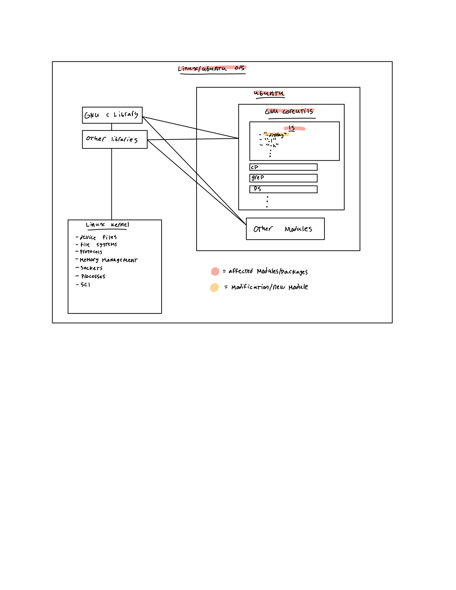

# Detailed Design Document

## 2.1 - Detailed list of Linux modules that will be modified/affected

The "ls" module is the only module that will be modified. It will accomodate a new command: "ls -display". The command is similar to calling "ls -lh". However, it has a few readability improvements (i.e. titles, formatting, etc.). Simply put, the modification will allow the user to print out a list of all files in a current directory. It does so in a modified "human readable format."

## 2.1 - Detailed list of any new modules that you will produce [or 'Not Applicable' if there are none]

Not Applicable.

## 2.3 - Class diagram showing affected modules [and any new modules] and how they related to one another

## 2.4 - List or table of explanations of all command line options that will be implemented

- ls

This is the command that is being modified. In terms of options, we are creating a new one: "-display". This the only command line option that we are implementing. It lists all files in a directory in a "human readable format." A mock up of the modification is below:

There will be blank columns where the green lines are. Also, headers will be above each generated column. This grants the user more understanding of what each symbol/file actually is.
