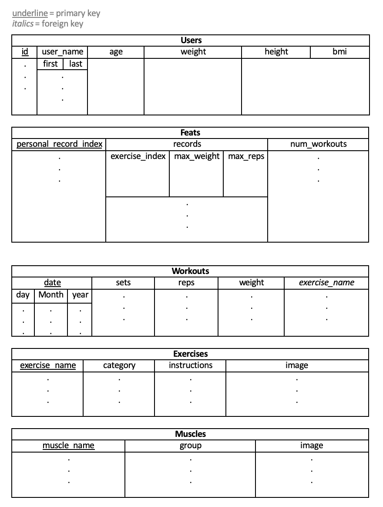
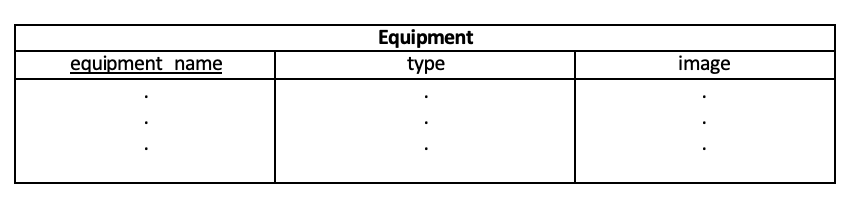
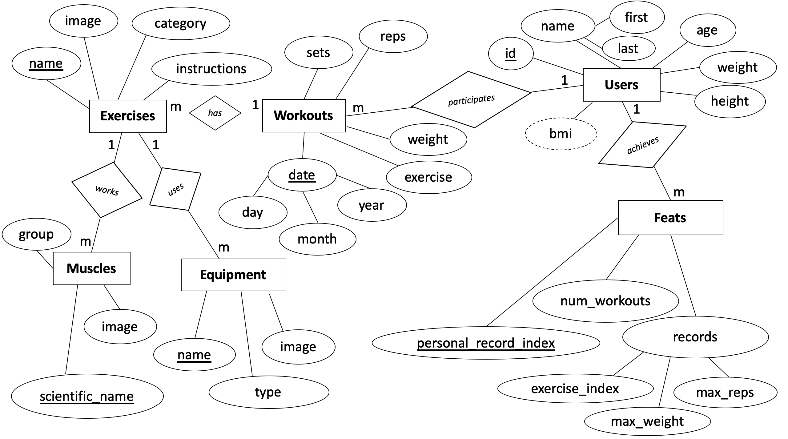

# 1.0 Database Preliminary Design Document

## 1.1 Project description
The project will be an implementation of a PostgreSQL exercise relational database. This database will be used by personal trainers, athletes, and avid gym-goers. The database's key utility is found in its provision of a) Efficient access to exercises and related information and b) Storage of workout data for self-evaluation over some time.

## 1.2 Data Description 
Currently, six entities could be constructed in the database. To give a general overview of the database's data, each entity will be described briefly.

* **User**  
The user will consist of basic profile information such as a name, age, height, weight, and Body Mass Index (also known as a BMI -- a derived attribute from weight in kilograms divided by height in meters squared). A user may "participate" in workouts and "achieve" feats.

* **Feats**  
For an exercise that a user participates in, the max amount of reps and weight may be recorded. An idea still being considered is whether a feat for all exercises is necessary. Professionals in health and fitness do prescribe a set of exercises that can "benchmark" a client's progress. Aside from personal maxes, the total number of workouts that a user has participated in will be stored. Further considerations include what other feats may be included for a user (i.e. the total amount of time spent working out per week). Such considerations may affect relationships with other entities.

* **Workout**  
Put simply, a workout consists of exercises with numerics for sets, repetitions per set, and weight. Suppose an exercise in a workout is the pushup or pistol squats. For exercises of the "body-weight" category, weight could either be the weight of the user or some placeholder value such as "body-weight" or "none". This is still up for consideration. A workout also has a date attribute to keep track of when a set of exercises was conducted. The date attribute is unique enough to act as a primary key for a workout. While there may be multiple workouts done in a day, this is a) Unlikely for a vast majority of users; and b) Possibly resolvable by appending data to an existing workout for the date.

* **Exercise**  
The exercise entity is fairly straightforward. Each exercise has a unique name and image. Instructions for an exercise is a brief description of a given exercise's movement. Categories for an exercise could include cardio, strength training, powerlifting, stretching, and more. An exercise may use equipment while working a set of muscles.

* **Equipment**  
There is a wide array of equipment available for exercises. Each equipment item has a unique name. Hence, the name may act as a primary key. An image of a piece of equipment would simply depict the item. Finally, the equipment can have a type that generally describes the item categorically (i.e. machine, band, weight, etc.).

* **Muscle**  
A convenient attribute of the muscle entity lies in each muscle's natural primary key: a scientific name. Muscles may be grouped within an area of the body (i.e. lower/upper back, chest, arms, etc). Images can depict the muscle area as a highlighted region of the body.

## 1.3 Usage Examples 

* **Example 1: Querying John Smith's BMI**  
To retrieve John Smith's BMI, simply choose the "User" table, "bmi" column, and add a conditional for the record's name to be "John Smith." In SQL: SELECT bmi; FROM Users; WHERE user_name.first = 'John', user_name.last = 'Smith'.  

* **Example 2: Querying all Records on Cardio Exercises**  
To retrieve all records categorized as "cardio", go to the "Exercise" table and condition the records with the category equal to the string: "cardio". Note that we are retrieving all records. Hence, the "*" in SELECT. In SQL: SELECT *; FROM Exercises; WHERE category = 'cardio'.

* **Example 3: Querying the Images of all Exercises Done on 01 January 2020**  
To retrieve an image of all exercises done on January 1st, 2020. We first JOIN the "Workout" and "Exercise" tables. Images for all exercises may then be retrieved by matching exercises in the two table's columns. Finally, filter the date column with records equal to "01012020". In SQL: SELECT image; FROM Workouts JOIN Exercises; WHERE exercise_name = exercise_name, date = '01-01-2020'.

* **Example 4: Querying all User IDs**  
To query all User IDs, go to the "User table" and select the id column. In SQL: SELECT id; FROM User.

* **Example 5: Querying all Exercise Names and Instructions**  
To retrieve all exercise names and instructions, go to the "Exercise" table and return everything in the "name" and "instructions" columns. In SQL: SELECT name, instructions; FROM Exercises.

## 1.4 Database Schema 

## 1.5 Entity-Relationship Diagram

