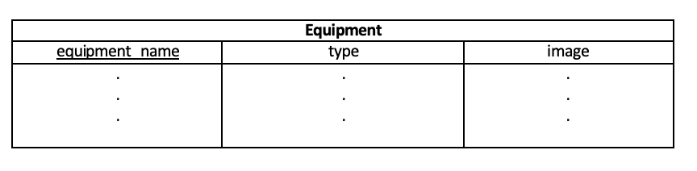

# 2.0 Database Detailed Design Document

## 2.1 – Project Description
The project will be an implementation of a PostgreSQL exercise relational database. This database will be used by personal trainers, athletes, and avid gym-goers. The database's key utility is found in its provision of a) Efficient access to exercises and related information and b) Storage of workout data for self-evaluation over some time.

The schema is further described in section 2.2. Generally, the schema is as follows:

## 2.2 – Data Dictionary

* **Users**
The user will consist of basic profile information including a name, age, height, weight, and Body Mass Index (BMI). A user may "participate" in workouts and "achieve" feats (entities described further in this document).

  - **id (primary key)**
An integer surrogate key that uniquely identifies a user.
 
  - **name** 
A string attribute consisting of the user’s first and last name.

  - **age**
An integer that holds the number of times that the individual has taken a trip around the sun.

  - **weight**
An integer value that contains the weight in pounds of the user.

  - **height**
An integer value that holds the height of the user to the nearest inch.

  - **bmi**
A rounded integer value determined from a user’s weight in kilograms divided by height in meters squared. Used to gauge trends in body fat levels over time. 

* **Feats**
For an exercise that a user participates in, the max amount of reps and weight can be recorded. It has been decided that a feat for all exercises can also be recorded since professionals in health and fitness prescribe a set of exercises that can "benchmark" a client's progress. Aside from personal maxes, the total number of workouts that a user has participated in will be stored.

  - **personal_record_index (primary key)**
An integer surrogate key indexing a record for a particular feat.

  - **num_workouts**
An integer value for the number of workouts a user has performed over time.

  - **records**
Consists of three integer values: a surrogate values for an exercise index (labeled exercise_index), the max number of reps performed (labeled max_reps), and the max amount of weight used (labeled max_weight).

* **Workouts**
Put simply, a workout is a set of exercises. It includes numerics for sets, repetitions per set, and weight for each exercise. Suppose an exercise in a workout is the push-up or pistol squats. For exercises of the "body-weight" category, the weight could be a placeholder string value such as "body-weight.” A workout also has a date attribute to keep track of when a set of exercises was conducted. The date attribute is unique enough to act as a primary key for a workout. While there may be multiple workouts done in a day, this is a) Unlikely for a vast majority of users; and b) Possibly resolvable by appending data to an existing workout for the date.

  - **date (primary key)**
A date value consisting of a day, month, and year of a set of exercises.

  - **exercise**
A string value consisting of the name of an exercise in the workout.

  - **weight**
An integer value of mass times acceleration due to gravity (also known as a person’s weight).
 
  - **sets**
An integer value for the number of sets completed in a given exercise.

  - **reps**
An integer value for the number of reps performed per set.

* **Exercises**
The exercise entity is fairly straightforward. Each exercise has a unique name and image. Instructions for an exercise is a brief description of a given exercise's movement. Categories for an exercise could include cardio, strength training, powerlifting, stretching, and more. An exercise may use equipment while working a set of muscles.

  - **name (primary key)**
The unique string name of an exercise (i.e. "back squats").

  - **image**
An image of an exercise that displays movements to be performed.

  - **exercise**
A string value of an exercise's name.

  - **category**
A string value used to convey the purpose of the exercise (i.e. "back" or "biceps").

  - **instructions**
A detailed string explaining how an exercise is performed.

* **Equipment**
There is a wide array of equipment available for exercises. Each equipment item has a unique name. Hence, the name may act as a primary key. An image of a piece of equipment would simply depict the item. Finally, the equipment can have a type that generally describes the item categorically (i.e. machine, band, weight, etc.).

  - **name (primary key)**
A unique string that describes the item used in a particular exercise.

  - **type**
A string value that places all of the pieces of equipment into categories for organizational purposes.

  - **image**
An image of the particular equipment so that it can be easily distinguished.

* **Muscles**
A convenient attribute of the muscle entity lies in each muscle's natural primary key: a scientific name. Muscles may be grouped within an area of the body (i.e. lower/upper back, chest, arms, etc). Images can depict the muscle area as a highlighted region of the body.

  - **scientific_name (primary key)**
A string describing a unique scientific name given to each muscle within the body.

  - **image**
An image of the individual muscle for ease of association.

  - **group**
A string describing the group of muscles within a given area of the body.

## 2.3 – Entity-Relationship Diagram (ERD)
